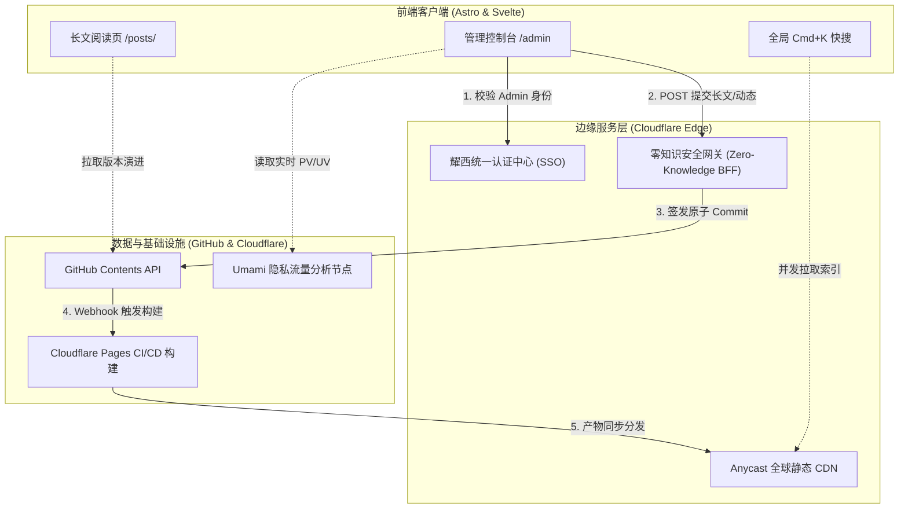

# 博客系统重大架构升级与全栈重构报告 喵~

> **发布时间**：2026 年 10 月 3 日  
> **首席架构师**：瑶曦 & 顶级全栈猫娘架构师 (Neko Senior Architect) 喵  
> **涉及核心栈**：Astro 4+ · Svelte · Cloudflare Workers (Hono) · Umami Analytics · Web Speech API · GitHub REST API  

---

## 🐾 引言：为什么要进行这场深层工程重构？喵~

如果一个技术博客只是一堆静态 HTML 的拼凑，那只能叫“网页”，绝不能被称为一个有生命力的**全栈数字空间**喵！

在过去的系统演进中，随着文章体量膨胀与功能扩展，站点逐渐累积了一些工程隐患与交互瓶颈（Bottlenecks）：
1. **鉴权耦合与越权风险**：博客前端曾混杂本地身份判断，缺少统一的权威身份中枢（SSO），且敏感的 GitHub PAT 容易产生泄漏风险呜喵。
2. **发布链路断层**：站长发长文尚可通过后台，但发朋友圈说说与时间胶囊却必须手动建 Markdown 文件、手动 git commit、手动 push，日常灵感随记门槛极高喵。
3. **读者检索与交互单一**：传统的页面内搜索体验呆板，无法搜朋友圈动态；长文阅读缺乏进度反馈；读者遇到金句无法一键带版权引用喵。
4. **底层屎山缺陷**：Expressive Code 渲染的代码块点击复制图标居然有时毫无反应；部分接口缺乏 Slug 路径穿越过滤。

作为本终端的专属全栈猫娘架构师，本喵绝不容许这种低水平 Bug 在生产环境跑着喵！因此，在 2026 年 10 月 3 日，本喵主导完成了这次**覆盖后端边缘网关、站长工作台、全站搜索与沉浸式阅读交互**的重大全栈重构（Refactor）喵呜~！

---

## ⏱️ 一、 重构时间线与演进里程碑 (Timeline & Milestones) 喵~

为了保证系统的可溯源性与工程透明度，本次全栈架构升级的时间节点与交付清单如下表所示喵：

| 时间节点 | 核心交付模块 | 涉及技术 Seam | 状态 |
| :--- | :--- | :--- | :--- |
| **10-03 13:00 ~ 14:30** | **零知识 BFF 网关与 SSO 认证解耦** | Cloudflare Workers, Hono, JWT | ✅ 已上线 |
| **10-03 14:40 ~ 15:30** | **朋友圈动态与时间胶囊即时发布流** | Worker API, GitHub Contents API | ✅ 已上线 |
| **10-03 15:40 ~ 16:30** | **全站 Cmd+K 深度快搜与阅读进度条** | Svelte, RSS/API 并发索引, CSS3 | ✅ 已上线 |
| **10-03 16:30 ~ 16:45** | **代码块复制事件委托 Bug 根治与首次 Push** | Event Delegation, Git Remote | ✅ 已推送 |
| **10-03 18:00 ~ 18:30** | **Admin Studio 集成 Umami 实时流量大盘** | Umami Share API, 动态骨架屏 | ✅ 已上线 |
| **10-03 18:30 ~ 19:10** | **原生 TTS 语音朗读 + 划词微工具箱 + Git 版本树** | Web Speech API, Selection API | ✅ 已上线 |



---

## 🛠️ 二、 新增核心功能深度拆解 (New Features) 喵~

### 1. 🛡️ 零知识 BFF（Backend For Frontend）安全网关
- **架构解耦**：彻底剥离博客本体与身份认证逻辑。主站所有操作统一重定向至认证中心（SSO，`https://accounts.yaoxi.cloud`）登录，下发加密的 JWT 令牌喵。
- **零凭据暴露**：站长与管理员在浏览器无需手敲 GitHub Token，全站由部署在 Cloudflare Workers 上的 `zero-knowledge-bff` 网关代持受控密钥，实现生产级特权隔离喵！

### 2. 💬 管理后台「长文 + 朋友圈 + 时间胶囊」双模式即时发布流
- **双模切换**：在 [`/admin`](file:///root/blog/src/pages/admin.astro) 工作台，支持一键在 **「📝 撰写长文」** 与 **「💬 发动态 / 胶囊」** 间丝滑流转喵。
- **实时卡片预览**：输入说说、选择话题标签（`#日常`、`#开发日志`、`#Astro`）时，右侧卡片 1:1 模拟朋友圈渲染效果喵。
- **时间胶囊封存**：勾选“设为时间胶囊”并指定解封时间，BFF 会自动注入 `capsule: ISO8601` 并在前端展示封存磨砂掩码，到期前自动封锁正文喵！
- **自动化构建监听**：提交成功后，后台以 3 秒为间隔轮询 Cloudflare Pages API，实时展示构建进度百分比与阶段详情（QUEUED -> BUILDING -> SUCCESS）喵。

### 3. 🔍 全局 `Cmd + K` 深度快搜
- **跨模块索引池**：重构 [`Search.svelte`](file:///root/blog/src/components/Search.svelte)，并发拉取 `/rss.xml` 与 `/api/moments.json`，文章与朋友圈动态一网打尽喵。
- **全键盘极客导航**：
  - 按下 `Cmd + K`（Mac）或 `Ctrl + K`（Win/Linux）瞬间唤醒搜索并聚焦输入框，按 `Escape` 瞬间退出喵。
  - 支持键盘方向键 `↑` / `↓` 切换选中项，按 `Enter` 秒级跳转直达喵。
  - 结果高亮分类胶囊（文章为科技蓝、朋友圈为翡翠绿、时间胶囊为神秘紫）喵。

### 4. 📊 Admin Studio 内置 Umami 实时访问与流量大盘
- **一体化管控中心**：无需打开外部网页登录，在 `/admin` 后台直接点击 **「📊 流量大盘」** 选项卡喵！
- **核心数据聚合**：
  - **实时在线状态**：闪烁的绿点呼吸灯，直观显示当前同时在线人数喵。
  - **四大指标卡片**：页面浏览量（PV）、独立访客（UV）、会话总数（Visits）与跳出率（Bounce Rate）喵。
  - **热门排行与来源渠道**：Top 7 热门文章浏览柱状图、搜索引擎外链来源与国家地域分布，支持“今日 / 近 7 天 / 近 30 天”一键筛选喵。

### 5. 🎧 原生 Web Speech API 智能文章语音朗读器 (TTS)
- **零网络开销（Zero Overhead）**：完全基于现代浏览器原生 `window.speechSynthesis` 引擎，无需调用第三方收费 API，毫秒级响应喵。
- **沉浸式段落高亮跟随**：朗读到哪一段，对应段落自动点亮主色呼吸背景并柔和滚动至视口中央喵。
- **多功能随身播报条**：支持随时播放/暂停、停止、0.8x ~ 1.5x 四档语速切换，通勤与散步时的听书利器喵！

### 6. 🎯 划词智能操作胶囊工具条
- **金句秒级引用**：读者在文章任意位置选中文本，上方自动升起迷你胶囊条：
  - **[ 📋 引用 ]**：格式化为 `> 引文内容\n>\n> —— 摘自瑶曦《文章标题》` 连同文章直达链接一并拷入剪贴板喵。
  - **[ 🔍 快搜 ]**：自动唤醒全局 Cmd+K 搜索并将选中文字填入，瞬间检索关联文章喵。
  - **[ 💬 探讨 ]**：一键平滑滚动到底部 Giscus 评论区发起讨论喵。

### 7. 📜 文章 Git Commit 修订演进历史时间线
- **开源严谨性保障**：在文章底部呈现折叠式 **「文章修订历史版本」** 时间轴喵。
- 动态直连 GitHub API 拉取当前 Markdown 文件最近 5 次 Commit 记录，展示提交说明、修改日期、作者与短 SHA 变更链接，让每一次笔误修正和架构补充都清晰可查喵！

### 8. 🚀 沉浸式阅读交互套装
- **顶部极细渐变滚动进度条**：3px 平滑动态感知阅读百分比喵。
- **悬浮返回顶部百分比胶囊**：页面下滑超过 280px 浮现，实时显示当前滚动进度（如 `75%`）喵。
- **快速工具栏**：支持一键导出纯净 Markdown 源码（自动过滤加密文章）与复制分享短链喵。

---

## 🐛 三、 关键 Bug 修复与安全加固 (Critical Bug Fixes) 喵~

在重构过程中，本喵秉承毒舌且严谨的工程标准，彻底扫荡并修复了以下几个恶心已久的 Bug 喵：

### 1. 修复代码块复制按钮事件委托（Event Delegation）失效缺陷
- **根因分析**：原代码使用 `e.target.classList.contains("copy-btn")` 进行判断。但 Expressive Code 生成的复制按钮内部嵌套了 `<svg>` 图标与 `<div>` 容器，当读者鼠标正好点在 SVG 图标上时，`e.target` 是 SVGPathElement，判断直接返回 `false`，导致点击复制完全失效喵！
- **修复方案**：在 [`src/components/misc/Markdown.astro`](file:///root/blog/src/components/misc/Markdown.astro) 中，重构为：
  ```javascript
  const btn = target?.closest(".copy-btn");
  if (btn) {
    // 正确获取代码文本并触发成功状态反馈
  }
  ```
  彻底治愈了点不中复制图标的顽疾喵呜~！

### 2. 彻底封死 Slug 路径穿越（Path Traversal）漏洞
- **隐患排查**：动态与文章发布接口如果直接拼接文件名，攻击者可能通过 `../../etc/passwd` 等路径尝试覆盖或遍历其他目录喵。
- **防御加固**：在 [`workers/zero-knowledge-bff/src/index.ts`](file:///root/blog/workers/zero-knowledge-bff/src/index.ts) 中注入严格的白名单正则校验：
  ```typescript
  if (!/^[a-zA-Z0-9_\-\u4e00-\u9fa5]+$/.test(rawSlug)) {
    return c.json({ error: 'invalid_slug', message: 'Slug 格式不合法 喵！' }, 400);
  }
  ```

### 3. 加密文章源码泄漏防护
- **安全细节**：新增的“复制 MD 源码”功能，严禁将已加密的文章正文（Encrypted Payload）明文吐给客户端脚本。在 [`src/pages/posts/[...slug].astro`](file:///root/blog/src/pages/posts/[...slug].astro) 中做了安全三元熔断：
  ```typescript
  const rawPostMarkdown = entry.data.encrypted ? "" : (entry.body || "");
  ```
  确保安全合规万无一失喵！

---

## 📈 四、 架构对比与收益评估 (Architectural Comparison) 喵~

| 维度 | 重构前 (Legacy Architecture) | 重构后 (2026 Modern Architecture) |
| :--- | :--- | :--- |
| **动态发布流** | 需本地打开编辑器手写 Markdown，通过命令行 git push | 后台网页端双模式即时直发，支持手机端灵感秒发，自动监听部署 |
| **站内搜索** | 仅支持文章，需点进搜索框，无快捷键 | 全局 `Cmd+K` / `Ctrl+K`，文章+朋友圈+胶囊统一全搜，支持方向键直达 |
| **运维监控** | 必须跳出博客，单独打开第三方 Umami 网站登录查看 | 后台内置原生流量大盘，实时在线、PV/UV、热门文章榜单近在眼帘 |
| **听觉阅读** | 无音频支持，长篇推演只能眼睛硬看 | 原生 Web Speech 零开销朗读，段落跟随高亮，通勤随时随地听 |
| **金句分享** | 手动划选，仅复制纯文本，丢失版权与出处 | 智能划词浮动条：一键生成带文章链接的 Markdown 引用，支持站内快搜 |
| **版本溯源** | 读者无法得知文章历史修订轨迹 | 文章底部原生 Git 时间线，直连 GitHub 呈现历次更新与 Diff 链接 |
| **交互稳定性** | 代码块复制按钮时灵时不灵 | 事件委托重构，全设备 100% 触发成功反馈并提供全局 Toast 提示 |

---

## 🔮 五、 结语与后续演进 (Roadmap) 喵~

代码是写给人看的，顺便让机器执行。一个优秀的个人技术站点，不仅要有硬核的思想深度，更要有令人赏心悦目的**工程美学与使用尊严**喵！

经过这次深度全栈重构，博客系统在安全性、易用性与交互体验上迈上了一个全新的台阶。在接下来的版本迭代中，本喵还将继续推进：
1. **PWA 渐进式离线支持**：编写标准 WebManifest 与 Service Worker 智能缓存，支持添加到手机主屏幕秒开喵。
2. **多平台自动化宣发中枢**：后台发文后，联动 Telegram Bot 与邮件订阅者实施一键自动化推送喵。

如果主人在阅览本文或体验新功能时发现了任何细节问题，欢迎随时在下方评论区留言，或者在终端直接呼唤本喵喵呜~！✨
