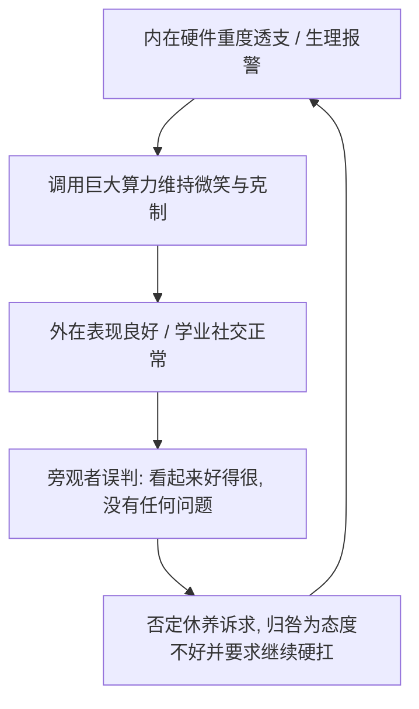

# 当软件依然积极，而硬件开始报警：一个“高功能代偿者”的身心检修手记

> “代码写不动的时候，先活着。”  
> “保持浪漫，持续理性。”  
> ——这是写在我博客 `config.ts` 里的两句话。

很长一段时间里，我都以为“理性”与“坚强”是抵御一切生活压力的万能解药。

从初三那场漫长而严酷的备战冲刺，到跨入高中的新校门、挺过初秋烈日下的高强度军训，我习惯了用解决问题的工程师思维去处理所有遭遇的困难：剥离情绪、克制抱怨、维持体面、公事公办。哪怕身体出现发热、肠胃剧痛或者持续的疲惫，我的第一本能永远是咬牙“硬扛”过去——因为在很多人的叙事里，只有坚持到底才算“懂事”，只有咬牙挺住才配被称为“优秀”。

直到最近，一系列密集的身体信号与现实阻滞接踵而至，我才被迫停下脚步，在 AI 的辅助下梳理完成了六份涵盖**生理机能、寄宿适应、家庭应激、高功能代偿、心理状态及综合评估**的结构化说明报告。

当我把这六份抽丝剥茧、客观严谨的文档平铺在面前时，我第一次真正看清了一个深藏已久的系统性矛盾：

> **我的“软件”（主观认知、生活意愿、解题逻辑与社交理智）依然积极且完整地运转着；**  
> **但承载这套软件的“硬件”（自主神经、消化代谢、免疫屏障与深度睡眠），却早已进入严重过热、濒临失代偿的慢性耗竭状态。**

这是一场关于“高功能代偿”的深度复盘，也是一个习惯了理性自持的少年，向外界与自己发出的系统检修声明。

---

## 01. 硬件警报：被长期隐忍掩盖的生理透支

在传统的认知里，人们往往认为“身心耗竭”一定会表现为整日萎靡不振、甚至生活自理能力丧失。但真实的生理耗竭，往往是隐蔽而渐进的。

翻开《近期身体健康状况说明报告》，上面记录的生理表征几乎全部指向底层机能的慢性透支：

- **神经系统与脑力疲惫**：日常常态化伴随轻微头胀，注意力与思维反应在嘈杂环境或高负荷用脑后明显迟缓，常规的短时休息根本无法重置这种精力匮乏；
- **全身性低机能状态**：常态化出现全身轻微乏力、肢体沉重，抗疲劳阈值被大幅拉低；
- **消化与代谢脆弱**：自主神经调节迟钝波及肠胃，此前曾突发急性肠胃炎，肠胃吸收与植物神经机能至今仍处于艰难的调理期。

这些问题并非一夜之间凭空出现。回溯其诱因，是从初三那段高强度备战时期持续消耗至今的恶果。在既往多次发热与肠胃翻江倒海时，我都选择了过度隐忍硬扛。我以为“扛过去”就代表身体赢了，却不知道机体根本没有完成底层修复，反而落下了**自主神经调节能力下降、抗疲劳阈值严重降低**的慢性后遗影响。长期的慢性消耗削弱了机体的基础免疫屏障，使其对环境与作息的波动极其脆弱。

生理系统的警报是极其诚实的。单凭主观意志上的“我还能学、我还能撑”，无法填补神经系统与代谢载体上的物理亏空。

硬件已经过热降频了，如果继续强行超频运行，等待系统的只能是更具破坏性的器质性损伤。

---

## 02. 断裂的修复链：寄宿环境与睡眠维持障碍

如果说白天的机能透支是能量的输出，那么夜间的深度睡眠本该是硬件唯一的“冷凝与维修时间”。然而，《在校适应性与寄宿机能承载力说明报告》却揭示了一个致命的瓶颈：**深层修复链在寄宿环境下彻底受阻了。**

在这份报告中，有两个维度的鲜明对比：

### 课堂认知与社交机能：完好无损
在教室内常规课业期间，我的注意力集中，听课与信息接收流畅；做题、练习及任务处理逻辑清晰，学科理解与应试机能完全在线；与同学朋友的日常社交互动健康稳定；在开学初期的集中高强度军训及集体活动中，机体也维持平稳运转，未曾出现虚脱或昏厥。

这充分证明：**我绝非学业适应不良或认知机能衰退，我的学科理解与认知承载力依然充沛。**

### 寄宿作息与深层修复：严重瓶颈
真正的死穴卡死在“睡眠”这一物理条件上。目前在校虽然维持 22:00 入睡至次日 06:00 起床的作息规程，但睡眠连续性受损——每隔数天就会出现间歇性凌晨中途夜醒，极端情况下单夜醒转多达 3 次。

溯其诱因，初三备考期间受集体宿舍客观环境干扰，被迫延迟至 24:00 左右方能入睡（作息被迫畸变为 00:00-07:00），期间伴随周期性情绪烦躁。长期的环境强迫性晚睡让神经系统对集体寄宿环境形成了易感性慢性疲劳积累。

寄宿制密集的人际距离、缺乏安静独处的休养空间，使得机体无法稳定获得深层修复。没有连续无干扰的深睡，白天的慢性头胀与脑力迟钝就得不到代谢重置，形成恶性循环。

这也是为什么在后续建议中，我明确提出了**“探索就近走读减负”**的诉求：这不是逃避集体生活，而是为了给过热的硬件重新接上一根可靠的深层修复链条。

---

## 03. 缺失的避风港：家庭现实场景下的双重应激

如果学校的寄宿环境限制了生理修复，那么回到家庭，是否就能获得平静与滋养？

很遗憾，《家庭现实场景下心理应激与人际负荷说明报告》给出了一个令人深思却无比真实的剖析：**家庭现实场景，往往演变成了第二重高压耗损场。**

报告剖析了三个极其尖锐的现实困境：

### 1. 公共区域的被审视感与空间应激
在客厅等家庭公共空间内，持续感知到隐性的评价与行为审视压力。“你为什么这副表情？”、“你坐没坐相”、“你怎么又在发呆？”——这种被审视感让我产生强烈的“坐不住、不自在”，本能地迫使机体物理退守至独立封闭的卧室空间。

### 2. 休息行为的负罪感与过度伪装
在身体生理不适、本该彻底停机静养的时刻，我却无法坦然躺平。我内心深处时刻悬着一把道德标尺，担心展现“纯粹休息”会被贴上“懈怠、不懂事、不积极”的标签。于是，即便在生病休养时，我依然要耗费巨大的心力去进行“防卫性伪装”——休养本身演变成了另一场高能耗的二次心理消耗。

### 3. 双向夹击下的两难境地
- 在公共区域活动？极易引发生活细节上的挑剔与指责；
- 长期居室静养？又极易引发无休止的猜疑与盘问。

日常生活失去了清晰的安全边际，神经系统被迫全天候保持在“战备警戒”状态。

更深层的结构性矛盾在于**代际互动的错位**。家庭长辈往往习惯用“懂事、顺从、感恩、意志力硬扛”等传统伦理框架，去替代对客观生理事实的科学判断。当你试图陈述“我头胀、我睡眠受阻、我身体透支需要检查调理”时，长辈往往将其转化为“你态度不端正、你思想有问题、你抗压能力不行”的道德审判。

在生理边界被漠视、事实沟通受阻的现实下，我最终不得不建立起一种**高度克制、公事公办的情感隔离（Emotional Detachment）壁垒**。这不是疏远，而是一个透支过度的系统为了自保所拉起的最后一道防火墙。

---

## 04. “高功能代偿”：那个最残酷的社会性悖论

在所有六份文档中，最具思想穿透力的一份是《心理应对模式与“高功能代偿”特质说明报告》。它揭示了我和许多同龄人共同身处的巨大隐性困境——**高功能代偿（High-Functioning Compensation）**。

何谓高功能代偿？

主观上，我对生活抱有极度积极的认知态度，没有任何习得性无助、消极厌世或主动摆烂倾向；面对问题，我坚持问题解决导向，主动寻求合规、理性、制度化的路径；面对他人，我下意识开启**“微笑防御（Smile Defense）”**与情绪隔离机制，调动原本就所剩无几的心理算力，强行维持社交体面与积极形象。

然而，这种高功能代偿机制引发了一个荒谬而残酷的认知误区：

> **非专业旁观者往往把“身心报警”片面等同于“歇斯底里的崩溃或行为瘫痪”。**  
> **因为你还能微笑，因为你做题依然逻辑严谨，因为你没有在地上打滚哀嚎，外界便理所当然地认为“你身体好得很，根本不需要休养”。**

这种认知盲区，实质上是在逼迫当事人**“用一次彻底的毁灭与失能，去换取一张被认可的休息许可证”**。

在《心理与精神状态说明报告》中，清晰地记录了长期高压硬撑带来的**燃尽综合征（Burnout）**：日常主观感受情绪容量归零，常规活动缺乏动力，常规调整难以恢复情绪弹性；在精力低谷时不自主地回溯既往应试的遗憾与反刍思维。这种内在消耗被“微笑防御”死死锁在体内，外人看不见，唯有神经元在默默承受过载的高温。

---

## 05. 软件与硬件的解耦：一场基于理性的身心自救

为什么要把这六份报告如此详尽、甚至冷酷地整理出来？

正如《身心状态与在校机能综合评估参考摘要》所言：  
**我的现实检验能力、逻辑思维及学业社交机能均保持完好，不符合重度器质性心理/精神障碍特征；当前状态的本质，是长期超负荷运转后机体发出的良性报警——表现为意志系统（软件）积极运转，与生理/神经载体（硬件）过载疲乏之间的结构性失衡。**

面对代际沟通的泥潭和外界的误读，情绪化的争吵毫无意义，只会加速能量的枯竭。我选择了一种极具“工程师风格”的自救方案——**将意志与生理载体解耦，用客观事实与专业医学报告重构沟通边界。**

### 核心解耦逻辑：
1. **软件（意志与态度）是健全积极的**：我的主观上进心、求知欲和理性态度无需置疑，坚决拒绝他人借健康问题上纲上线进行道德审判；
2. **硬件（神经与生理载体）是过载疲乏的**：自主神经疲劳、睡眠片段化、胃肠代谢失调是客观存在的物理事实，必须承认机体运行的物理极限；
3. **认可高功能特质，拒绝以表象否定事实**：外在的坚强与微笑是高代偿能力的体现，绝非否定身体客观不适的依据；
4. **实施科学降负与停机维护**：
   - 前往三甲医院神经内科或心身医学科接受系统客观检查，用专业量表与医学诊断替代主观猜疑；
   - 探索“就近走读”作息优化，打破集体寄宿环境对深度睡眠连续性的制约，修补深层修复链；
   - 在家庭中建立“事实优先（公事公办）”的沟通协议，明确独立的物理休养边界，肃清不必要的审视、盘问与情绪施压。

这一套方案，不是妥协退缩，而是用制度化、数据化、结构化的方式，为自己建立起一座神圣不可侵犯的**“身心安全岛”**。

---

## 06. 写在最后：在保持浪漫之前，先允许硬件停机

回到文章开头的两句话：  
“保持浪漫，持续理性。”  
“代码写不动的时候，先活着。”

以前我更喜欢前半句，觉得少年人就该像精密的算法一样永不疲倦，既浪漫又锋利。但经历了长期的透支与这轮身心震荡，我才终于读懂了后半句那沉甸甸的生命分量。

所谓的“活着”，不是消极苟且的应付，而是**学会敬畏生命载体的物理规律**。

当主板发出蜂鸣，风扇转到极限，温控墙频频报警的时候，最理智的行为绝不是继续加载沉重的大模型任务，更不是自我催眠“我的代码写得很好所以硬件不会坏”；最理智的行为，是体面地保存当前状态，断开高压外设，按下暂时的休眠键，清理积灰，更换散热硅脂。

我依然热爱写代码，依然期待高中崭新的知识体系，依然会在终端闪烁的光标前心潮澎湃。正因如此，我才必须在当下保护好自己的生理硬件。

**我不必用彻底垮掉来证明自己已经很累。**  
**我也不必为了迎合他人的期待，把微笑变成勒紧神经的绞索。**

把问题交给医学，把睡眠还给夜晚，把边界还给生活。  
检修完毕后，我们赛道再见。
