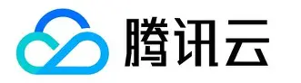
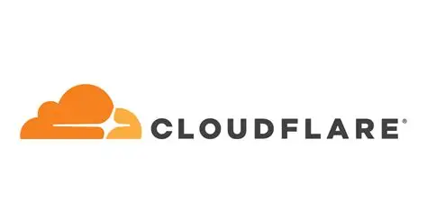

# [(腾讯云（Tencent Cloud）](https://cloud.tencent.com)

腾讯云是腾讯公司倾力打造的云计算品牌，依托腾讯在社交、游戏、音视频等领域二十余年的技术积淀，目前已成为全球领先的数字化转型合作伙伴。

## 1. 核心基础设施（IaaS）

腾讯云在全球 26 个地理区域运营着 70 个可用区。

- **计算：** 提供标准型云服务器（CVM）、轻量应用服务器（Lighthouse）以及专为高性能计算设计的黑石物理服务器（CPM）。
    
- **存储：** 涵盖对象存储（COS）、云硬盘（CBS）及文件存储（CFS），满足海量数据的冷热处理需求。
    
- **网络：** 凭借全球加速网络（CDN）和私有网络（VPC），提供极速、安全的互联体验。

## 2. 数据库与开发者工具（PaaS）

- **数据库：** 自研的企业级分布式数据库 **TDSQL**，支撑了金融级高一致性需求；同时提供云原生数据库 **CynosDB**，兼容 MySQL 和 PostgreSQL。
    
- **云原生：** 提供完备的 Kubernetes（TKE）容器服务、无服务器云函数（SCF），助力企业实现敏捷开发。

## 3. 音视频与通信优势

这是腾讯云的“王牌”领域：

- **TRTC（实时音视频）：** 提供低延时、高品质的互动直播和音视频通话方案。
    
- **IM（即时通信）：** 承载亿级消息并发处理能力，帮助应用快速集成聊天功能。
    
- **边缘安全加速（EdgeOne）：** 集成了 DDoS 防护、WAF 及 CDN 加速，实现“安全+加速”一体化。

## 4. 智能与行业解决方案

- **腾讯混元大模型：** 通过 **TI 平台** 提供全栈 AI 能力，支持企业进行模型精调与 Agent 智能体开发。
    
- **行业应用：** 深入金融、政务、文旅、教育及工业等领域，提供针对性的数字化转型工具包。
---

## [(阿里云（Alibaba Cloud）](https://aliyun.com)

阿里云成立于 2009 年，是全球领先的云计算及人工智能科技公司。作为中国云服务的开拓者，其业务规模长期位居亚太第一、全球前三。

## 1. 核心计算与基础设施 (IaaS)

阿里云拥有自主研发的超大规模通用计算操作系统——**飞天（Apsara）**。

- **计算服务：** 包括弹性计算（ECS）、轻量应用服务器（SAS）及专为高性能计算设计的神龙（SHENLONG）架构。
    
- **全球布局：** 节点覆盖全球 30 个地理区域、89 个可用区，拥有极高的网络可用性。
    
- **存储与网络：** 提供对象存储（OSS）、块存储（EBS）及全球加速（GA）等底层设施，支撑双 11 等极致高并发场景。

## 2. 数据库与数据智能 (PaaS)

- **自研数据库：** **PolarDB**（云原生数据库）与 **AnalyticDB**（云原生数据仓库）是其核心竞争力，能够实现高性能的读写分离与海量数据处理。
    
- **大数据处理：** **MaxCompute** 提供 PB 级的数据仓库能力，配合 **DataV** 能够实现复杂的数据可视化。

## 3. AI 与大模型生态

阿里云在 AI 领域构建了“一云多能”的架构：

- **通义千问 (Qwen)：** 阿里自研的超大规模语言模型，涵盖文本、音频、视觉等多个维度。
    
- **百炼 (Model Studio)：** 一站式大模型应用开发平台，支持企业进行模型训练、微调及 Agent 部署。
    
- **PAI 平台：** 为开发者提供从底层算力到顶层算法的机器学习全流程支持。

## 4. 钉钉与产业互联

阿里云强调**“云钉一体”**战略，将钉钉作为企业数字化的入口。

- 通过低代码开发平台（如宜搭），让非技术人员也能快速搭建企业应用。
    
- 深耕政务、金融、制造、新零售等行业，提供深度定制的数字化转型方案。

---

## [Cloudflare 科赋锐](https://www.cloudflare-cn.com/)

Cloudflare 是一家全球领先的“连接云（Connectivity Cloud）”公司。与传统的阿里云、腾讯云等中心化云厂商不同，Cloudflare 的核心逻辑是**“边缘优先”**，其网络节点遍布全球 300 多个城市，旨在为互联网应用提供加速、安全和无服务器计算能力。

## 1. 安全与防护（核心护城河）

Cloudflare 以强大的 **DDoS 防护** 闻名，其网络总容量超过 400 Tbps，能吸收史上最大规模的流量攻击。

- **WAF (Web 应用防火墙)：** 实时拦截 SQL 注入、跨站脚本等 Web 攻击。
    
- **Bot Management：** 利用机器学习识别并拦截恶意爬虫，同时放行搜索引擎等友好爬虫。
    
- **Zero Trust (Cloudflare One)：** 提供企业级的远程办公安全方案，替代传统 VPN，实现基于身份和设备的细粒度访问控制。

## 2. 性能与加速

- **CDN (内容分发网络)：** 全球 95% 的互联网用户距离 Cloudflare 节点的延迟在 10ms 以内，大幅提升网页加载速度。
    
- **Argo Smart Routing：** 像导航一样，自动避开互联网上的拥堵路径，选择最快线路传输数据。
    
- **Images & Stream：** 提供一站式的图片优化和视频流处理服务。

## 3. 开发者平台 (Serverless / Edge Computing)

这是 Cloudflare 近几年增长最快的业务，旨在让代码直接在“边缘”运行：

- **Workers：** 极轻量级的无服务器计算环境，延迟远低于传统的云函数。
    
- **R2 Storage：** 兼容 S3 协议的对象存储，其核心卖点是**“零出站流量费（Zero Egress Fees）”**，直接挑战 AWS 等厂商的高额流量费用。
    
- **Cloudflare D1 / KV / Durable Objects：** 完备的边缘数据库体系，支持分布式存储和强一致性数据处理。

## 4. 2026 年最新趋势：AI 与连接

- **Workers AI：** 在全球边缘节点部署了大量 GPU，支持开发者直接在边缘端运行 Llama 4、通义千问等大模型推理，实现超低延迟的 AI 交互。
    
- **AI Security for Apps：** 专为 AI Agent 和生成式应用打造的安全层，防止模型注入和隐私泄露。