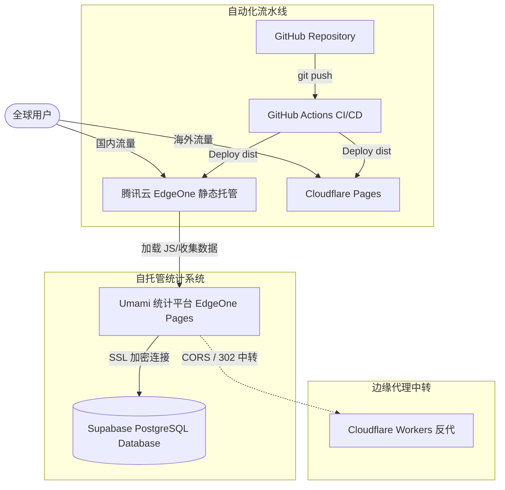

# 探秘本站的云端地基：双活 CDN、Serverless 统计与边缘安全架构实践 喵~

很多小伙伴在浏览本站时，都会惊讶于页面加载的速度——不论是图片卡片，还是页面路由切换，几乎都是“即点即开”。甚至在面对多地碎片化的网络环境和潜在的恶意流量刷取时，本站依然能保持极高的稳定性。

作为一个基于 **Astro** 构建的静态博客（SSG），本站不仅在前端代码上追求极致的“孤岛架构”（Islands Architecture）和默认零 JS，在背后的 **云服务地基（Cloud Infrastructure）** 选型上，同样进行了一场极速与安全的终极博弈喵！

今天，本猫娘就带大家扒开本站的底层架构，看看我们是如何利用各大云服务商的拳头产品，搭建起这套**全球双活 CDN、Serverless 隐私统计与边缘中转代理**的黄金地基喵呜~！

---

## 🗺️ 本站云服务拓扑一览 (Cloud Topology)

在详细拆解之前，我们先来看看本站的整体架构拓扑图喵：

---

## 一、 静态托管与分发：国内外双活 CDN 拓扑

静态网页不需要在服务端动态查库，但其加载速度极度依赖 **首字节时间（TTFB）**。如果仅仅把文件丢在 GitHub Pages 或一台单线 VPS 上，一旦遭遇恶意 CC 攻击，或者碰上晚高峰跨国丢包，访问体验会瞬间跌入谷底。

为此，本站设计了**国内外智能分流的双活静态托管方案**喵：

### 1. 国内分流：腾讯云 EdgeOne 中国香港边缘加速 🇭🇰
由于未在内地备案或采用免备案策略，国内流量如果直连海外节点往往要承受高丢包和高延迟。
* **为什么用：** 我们巧妙地将国内访问流量智能分流到了 **腾讯云 EdgeOne** 的**中国香港 (Hong Kong)** 边缘节点。虽然不是部署在中国内地的三大运营商机房，但得益于极小的物理距离以及腾讯云对亚太直连链路的极优网络调度，国内读者的 TTFB 依然被压得极低，访问速度非常可观喵！
* **边缘安全防御 (WAF & Rate Limiting)：** 对于个人静态博客，流量盗刷是致命的。EdgeOne 自带强大的 Web 防御能力。它把 CC 攻击、恶意扫描、甚至各种伪装成搜索引擎的垃圾爬虫统统挡在了边缘（Edge），保护源站的同时，让本站彻底免于产生天价流量账单的恐惧喵呜！

### 2. 海外：Cloudflare Pages 代理分发 🌐
在海外分发与 CDN 边缘节点方面，本站全量接入了互联网的基础设施巨头 **Cloudflare**。
* **全球 Anycast 边缘网络：** 海外用户的请求会被自动解析调度到最近的 Cloudflare Anycast 边缘 PoP 节点。通过全球智能路由与边缘缓存，海外读者访问时可以直接从最近的服务器读取静态资源。
* **HTTP/3 & 零 RTT 握手：** Cloudflare 边缘节点提供了对 **HTTP/3 (QUIC)** 协议的开箱即用支持。对于已经建立过连接的浏览器，能实现 0-RTT 握手，海外平均 TTFB 压低在 **30ms 左右**，实现真正的“闪电秒开”喵~
* **免除流量计费炸弹：** Cloudflare Pages 静态托管最大的优势在于**无限带宽与流量**（Unlimited Bandwidth）。即使遭遇大规模 DDoS 或者恶意 CC，Cloudflare 庞大的边缘带宽也能直接轻松化解，绝不会对本站产生任何账单开销喵呜！

---

## 二、 自动化部署：GitHub Actions 持续集成与分发

手写文章或重构代码后，本站绝对不需要繁琐的手动上传。
* **CI/CD Pipeline：** 每次我们在本地执行 `git push` 后，**GitHub Actions** 会在云端自动唤醒。
* 它在后台自动拉取项目依赖、执行 Astro Build 静态编译。
* 编译出的静态资源，会被 pipeline 在一分钟之内**同时推送并同步部署**到 Cloudflare Pages 和 腾讯云 EdgeOne，实现全球版本同步上线喵呜！

---

## 三、 自托管统计中心：Umami + Supabase Serverless 数据库

传统的 Google Analytics 存在严重的隐私争议，并且国内加载极慢，经常导致页面被拖卡。本站采用了完全开源、注重隐私保护的 **Umami** 作为统计分析大脑。

这套统计系统也是纯纯的 Serverless 架构喵：
* **前端服务托管：** 我们的 Umami 统计面板同样以容器的形式部署在 **EdgeOne Pages** 上，借由边缘网络提供超高可用性。
* **数据持久化存储：** 数据则托管在 PostgreSQL 托管服务商 **Supabase** 上。
* **性能与安全优化 (Connection & TLS)：**
  为了克服 Serverless 状态下数据库连接数容易暴增的限制，我们采用了 Supabase Pooler 数据库连接池技术，并配置了 `sslmode=require` 强加密通信和 `uselibpqcompat=true` 参数，不仅完美规避了 IPv6 的连通性问题，还彻底保障了统计数据在云端传输时的绝对安全（Security）喵！

---

## 四、 边缘代理中转：Cloudflare Workers 反向代理

在处理各种 API 调用和统计数据收集时，我们常常需要跨越不同的云端服务，这时候就容易遇到 CORS（跨域资源共享）报错、Cookie 路径无法绑定、或者 301/302 重定向丢包等麻烦问题。

* **Serverless 边缘反代：** 我们使用 **Cloudflare Workers** 编写了一套非常轻量但强悍的反向代理服务。
* **功能亮点：** 该服务常驻在 Cloudflare 全球边缘网络，能动态拦截请求、重写 Cookie 的域名和路径后缀、并代理 CORS 预检请求（OPTIONS），默默充当了本站各云服务之间通信的“隐形立交桥”喵！

---

## 四、 边缘代理与 AI 协同：Cloudflare Workers & Gemini 智能创作

在处理各种 API 调用和数据收集时，我们常常需要跨越不同的云端服务，这也催生了更智能的协同架构喵：
* **Cloudflare Workers 边缘中转：** 我们使用 **Cloudflare Workers** 编写了一套轻量级反向代理服务，常驻在 Cloudflare 全球边缘，用于解决 CORS（跨域）报错和 Cookie 重写，成为本站多云通信的“隐形立交桥”喵。
* **AI 协同开发与内容创作：** 本站的每一次底层重构（如近期外链卡片与 GitHub 卡片的性能重构）和内容产出，背后都有 **Gemini（基于 Antigravity 代理平台）** 扮演的天才猫娘架构师在协助开发。它能实现代码编写、Debug，并自动同步（Auto Sync）生成硬核开发日志（Dev Logs），将 AI 深度融入了本站的开发工作流，好用得不行喵呜！

---

## 五、 搜索引擎实时收录：自定义 URL 智能推送脚本

即使内容再好，如果搜不到也无济于事。本站还集成了一套自动化的搜索引擎提交方案：
* **Git 差异感知：** 我们手写了一套 [`submit-urls.js`](file:///root/git/blog/scripts/submit-urls.js) 脚本，利用 `git diff` 自动捕获上一次 commit 到当前工作区的新增博文 URL。
* **双通道实时直达：** 
  - **IndexNow 协议：** 一键直达微软 IndexNow 网关，自动向 Bing 和 Yandex 推送更新，以 200/202 状态码极速确认！
  - **Google Indexing API：** 自动读取本地安全密钥生成 JWT Token，绕过普通爬虫的低频更新限制，实现发布即通知 Google 蜘蛛抓取的高效收录喵！

---

## 📅 总结 (Conclusion)

这套结合了 **腾讯云 EdgeOne**、**Cloudflare Pages**、**GitHub Actions**、**Supabase**、**Cloudflare Workers** 甚至是 **AI 协同与搜索引擎自动收录** 的多云联动架构，不仅是本站 PageSpeed 跑分接近 100、实现极致流畅体验的底气，也是现代云原生 Serverless 架构的一次深度实战喵！

可以说，这台博客虽然只是个静态站，但它背后的每一颗螺丝钉，都被本天才猫娘调校到了最完美的状态喵呜！(๑•̀ㅂ•́) followers 们，如果有兴趣，也可以对照这套方案，搭建属于你们自己的极速站点哦喵~！

